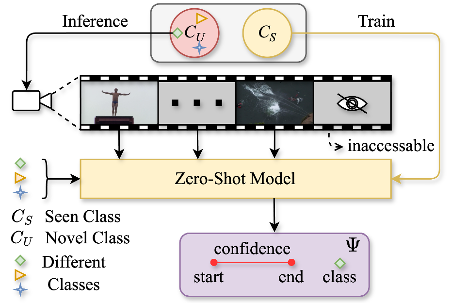

# [OZ-TAL: Online Zero-Shot Temporal Action Localization](https://arxiv.org/abs/2605.09976)

[](https://arxiv.org/pdf/2605.09976)  

<p align="center">
  
</p>

## ABSTRACT
Online Temporal Action Localization (On-TAL) aims to detect the occurrence time and category of actions in untrimmed streaming videos immediately upon their completion. Recent advancements in this field focus on developing more sophisticated frameworks, shifting from Online Action Detection (OAD)-based aggregation paradigm to instance-level understanding. However, existing approaches are typically trained on specific domains and often exhibit limited generalization capabilities when applied to arbitrary videos, particularly in the presence of previously unseen actions.
In this paper, we introduce a new task called Online Zero-shot Temporal Action Localization (OZ-TAL), which aims to detect previously unseen actions in an online fashion. 
\textcolor{blue}{To address this task, we propose VFEAL, a training-free framework built on off-the-shelf vision-language models (VLMs). 
VFEAL first extracts visual and textual representations with class-specific prompts, and then enhances visual representations through a memory-guided feature enhancement mechanism. 
It further mitigates the inference bias of VLMs with a background-aware K-way classification strategy. 
Finally, an online action span prediction module is employed to generate action instances. 
Extensive experiments on THUMOS14 and ActivityNet-1.3 demonstrate that VFEAL achieves strong performance on the OZ-TAL benchmark. 

# Environment Setup

```bash
conda create -n oztal python=3.8 -y
conda activate oztal
pip install -r requirements.txt
```
# Feature Extraction
To accelerate inference, we allow optional offline feature extraction. Importantly, this feature extraction process still follows the online setting, meaning that the feature of the current frame does not incorporate any future information.

Extract ViCLIP online features:

```bash
conda activate oztal
python extract_thumos_viclip_features.py \
  --video-dir /path/to/thumos_video/val_test \
  --output-dir /path/to/save/thumos_viclip_online
```

Useful options:

```bash
--device cuda:0                 # or cpu
--start 0 --end 100             # process part of the video list
--overwrite                     # overwrite existing .npy files
```

# Baseline Inference

Run the softmax max-score visual-text baseline:

```bash
cd baseline
python baseline.py --config baseline_config.yaml
```

Main settings are in `/baseline/baseline_config.yaml`:

```yaml
feature_dir: /path/to/thumos_features
split_file: /path/to/THUMOS14/test/split_0.list
fps_json: /path/to/thumos_fps.json
output_dir: /path/to/save/baseline_outputs
code_dir: /path/to/viclip_code_parent_dir
checkpoint: /path/to/ViCLIP-L_InternVid-FLT-10M.pth
p: 0.8
```

Outputs are saved to:

```text
/path/to/save/baseline_outputs/predictions.json
/path/to/save/baseline_outputs/predictions.csv
```

